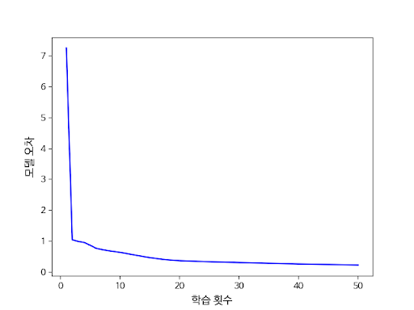

# 개요
> 2023 선린 인공지능 모델링 교과 프로젝트로 진행한
> 
> <가위바위보 인공지능 만들기> 프로젝트 입니다.

# 보고서
프로젝트 결과물을 위한 보고서를 작성했습니다. <br>
프로젝트에 대해 자세하게 알고 싶다면 이곳을 참고해주세요.
[보고서 바로가기](https://drive.google.com/file/d/1SoAQeyaQgwolm66yWDZ6LaOOCfC1vS5_/view?usp=sharing)

# 시연 영상
|      시연 영상       |                 바로 가기                  |
|:----------------:|:--------------------------------------:|
| 이미지 데이터 추출 시연 영상 | [바로 가기](https://youtu.be/sW1F4LhtmNw)  |
| 손동작 인식 모델 시연 영상  |  [바로가기](https://youtu.be/U5xANge6TOU)  |
|  가위바위보 게임 시연 영상  |  [바로가기](https://youtu.be/YH59REBDDV4)  |

# 프로젝트 진행 방법
1. 가위 바위 보 손동작 이미지를 수집한다.
2. 구글 미디어 파이프를 사용해서 이미지에서 손의 마디가 이루는 각도를 추출한다.
3. 해당 각도를 사용해서 분류 모델을 제작한다.

# 모델 구조

|           레이어            |      활성화 함수       | 레이어 크기 |        파라미터 수        |
|:------------------------:|:-----------------:|:------:|:--------------------:|
|    입력층 (Input Layer)     |                   |   16   |          16          |
|  은닉층 1 (Hidden Layer 1)  |   Relu Function   |   30   | 510개 (=16 * 30 + 16) |
|  은닉층 2 (Hidden Layer 2)  |   Relu Function   |   20   |         620개         |
|  은닉층 3 (Hidden Layer 3)  |   Relu Function   |   10   |         210개         |
|  은닉층 4 (Hidden Layer 4)  |   Relu Function   |   5    |         55개          |
|    출력층 (Output Layer)    | Soft Max Function |   3    |         18개          |

## 학습 방법
|         항목         |               사용 방법                |
|:------------------:|:----------------------------------:|
|       옵티마이저        |                Adam                |
|       손실 함수        | Categorical cross entropy Function |
|   학습 횟수 (epochs)   |                50회                 |
|     Batch size     |                500                 |
| Validation data 비율 |                0.25                |


## 모델 성능
<figure>
    
</figure>

|  항목  |    수치    |
|:----:|:--------:|
|  오차  |  1.32%   |
| 정확도  |  99.68%  |

> 📝️ 상당히 높은 수치의 정확도를 가진 모델이 완성되었습니다.


# 레파지토리 구조
```
┌
│  main.py              // 메인 파일, 가위 바위 보 게임 진행하는 파일
│  DataGenerator.py     // 이미지 데이터 분석을 위해 제작한 모듈
│  image_dataset.py     // 이미지 데이터셋 분석에 사용한 파일
│  MediaPipePractice.py // 구글 미디어 파이프 학습을 위해서 시용한 파일
│  model_test.py        // 제작한 모델의 테스트를 위해서 사용한 파일
│
├─data
│  │  data.csv          // 이미지 데이터셋 분석 결과
│  ├─0                  // 데이터 셋
│  │  ├─paper
│  │  │      ...
│  │  ├─rock
│  │  │      ...
│  │  └─scissors
│  │  │      ...
│   ...
├─model
│      model1.hdf5      // 모델 1 (정확도 : 99.65%)
│      model2.hdf5      // 모델 2 (정확도 : 99.20%)
└─
```